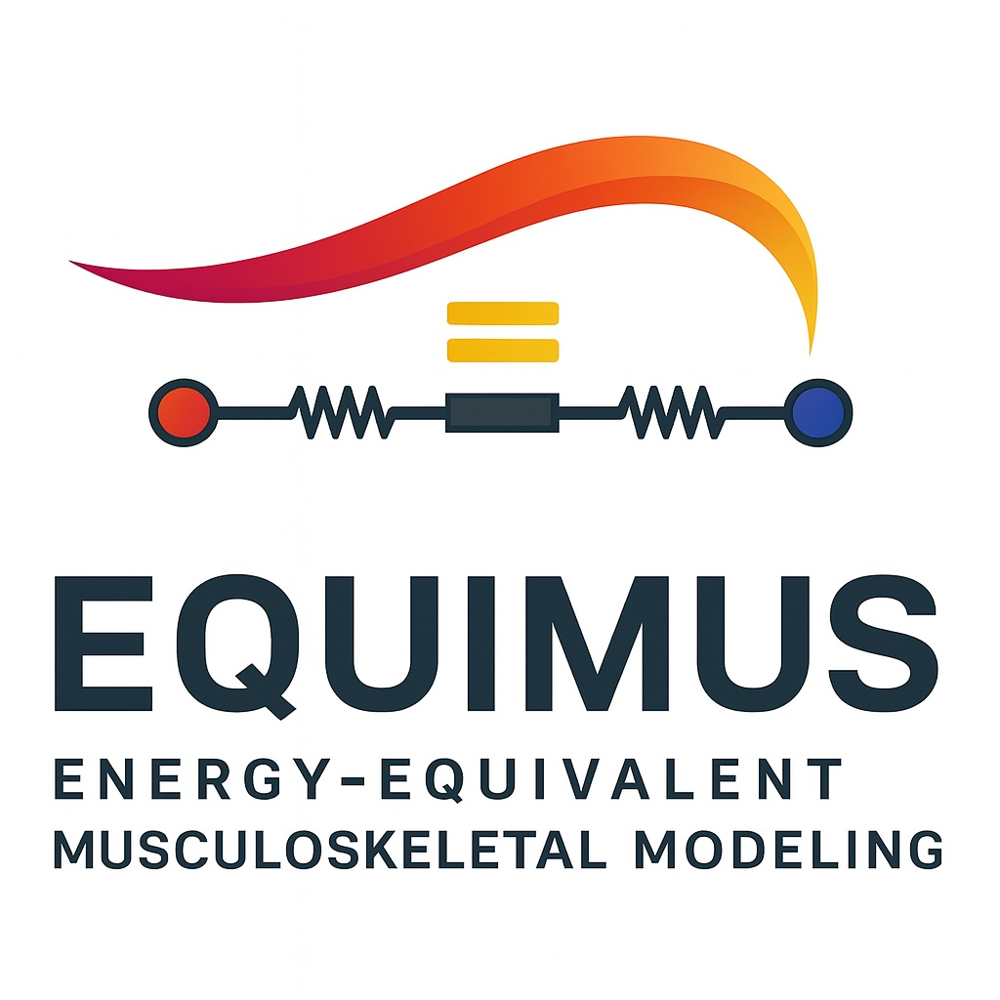
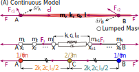
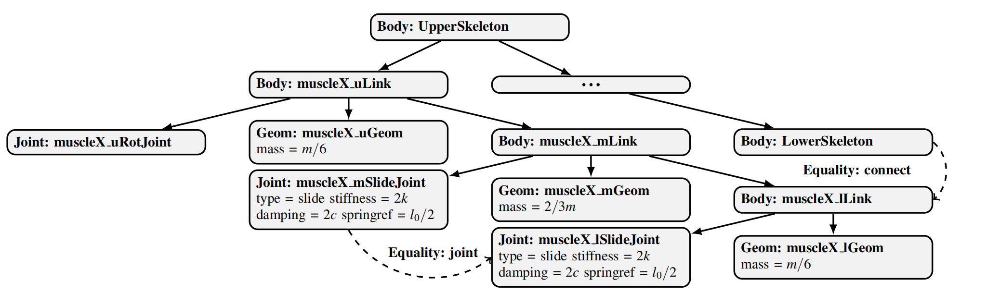
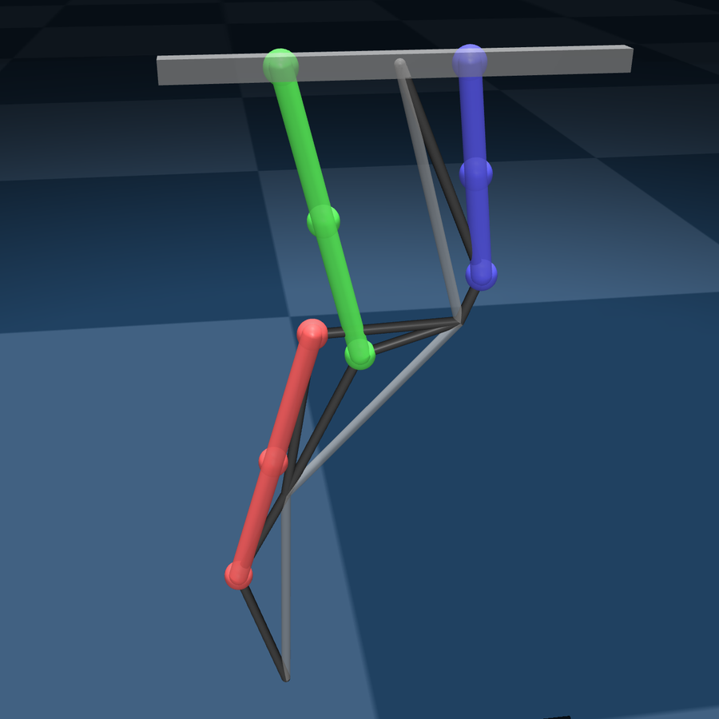
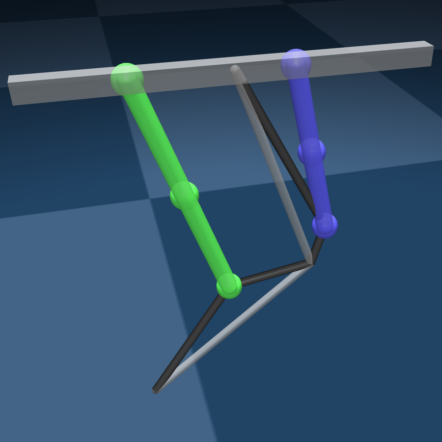
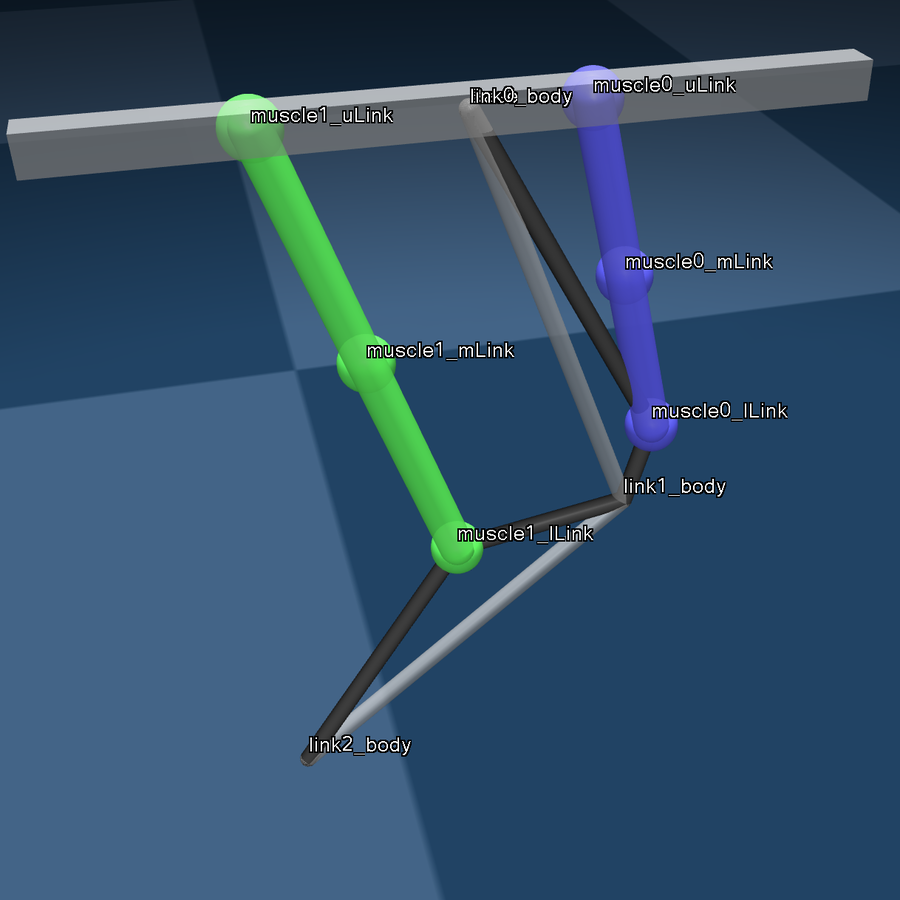
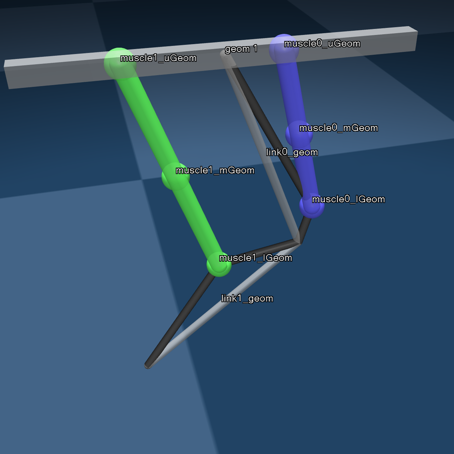
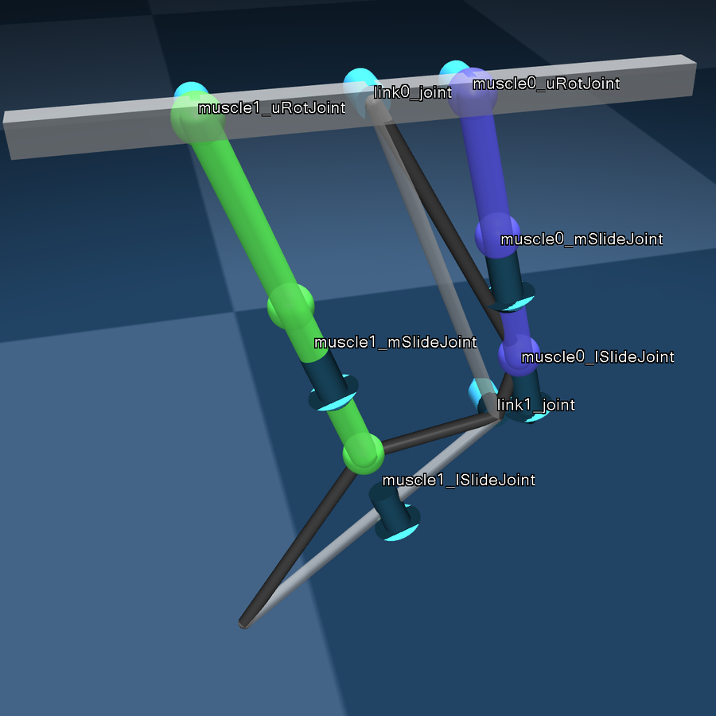

<p align="center">
  
</p>

# EquiMus: Musculoskeletal Equivalent Dynamic Modeling and Simulation for Rigid-soft Hybrid Robots with Linear Elastic Actuators


## Table of Contents
- [EquiMus: Musculoskeletal Equivalent Dynamic Modeling and Simulation for Rigid-soft Hybrid Robots with Linear Elastic Actuators](#equimus-musculoskeletal-equivalent-dynamic-modeling-and-simulation-for-rigid-soft-hybrid-robots-with-linear-elastic-actuators)
  - [Table of Contents](#table-of-contents)
  - [About This Work](#about-this-work)
    - [Design Philosophy](#design-philosophy)
    - [Abstract](#abstract)
    - [TL;DR](#tldr)
    - [Core Implementation](#core-implementation)
  - [Install and try EquiMus in 3 minutes!](#install-and-try-equimus-in-3-minutes)
  - [Data Download](#data-download)
  - [FFmpeg install](#ffmpeg-install)
  - [Project Structure](#project-structure)
  - [Statics of this repo](#statics-of-this-repo)

## About This Work

### Design Philosophy
**[EN]** EquiMus fakes how nature uses energy to control motion — through an energy-equivalent formulation that turns physics intuition into simulation reality. That is the “fake it until you make it” philosophy in the energy domain.

**[CN]** 假之以能量，得之于运动。以伪成真，以虚造实。斯为自然之道，亦乃人之所驭。

### Abstract
Leveraging the full potential of soft robots relies heavily on dynamic modeling and control, which remains challenging due to their complex constitutive relationships and real-world operational scenarios. Bio-inspired musculoskeletal robots, which integrate rigid skeletons with soft actuators, combine the advantages of heavy load-bearing capacity and inherent flexibility. Although actuation dynamics has been studied through experimental methods and surrogate models, accurate and effective modeling and simulation still pose a significant challenge when soft actuators are applied at a large scale, especially in hybrid rigid-soft robots with continuously distributed mass, kinematic loops and diverse motion modes.

To address this issue, this study introduces **EquiMus**, a musculoskeletal equivalent dynamic modeling and MuJoCo-based simulation for rigid-soft hybrid robots with linear elastic actuators. The equivalence and effectiveness are proven in detail and examined through simulated and real experiments on a bionic robotic leg. Based on the energy-equivalent model and simulation, we do some explorations in model-based and data-driven control algorithms including reinforcement learning.

### TL;DR
We proposed EquiMus, an energy-equivalent dynamics and simulation for the rigid-soft musculoskeletal robots with linear elastic actuators. The method captures dynamic mass redistribution, supports loop-closure constraints in MuJoCo, and remains real-time capable. Experiments on a pneumatic leg show close sim-to-real agreement and enable downstream usage in PID auto-tuning, model-based control, and reinforcement learning.

### Core Implementation

The robot dynamics are formulated using the vector form of the Lagrangian equation,
$$
    (\frac{d}{dt} \frac{\partial }{\partial \dot{\mathbf{q}}} - \frac{\partial }{\partial \mathbf{q}}) (L_{\text{EA}}+L_{\text{other}}) = \mathbf{Q}_{\text{EA}} + \mathbf{Q}_{\text{other}}
$$
where $L$, $\mathbf{q}$, and $\mathbf{Q}$ denote the Lagrangian, generalized coordinates, and generalized forces respectively. We decompose $L$ and $\mathbf{Q}$ into contributions from elastic actuators (EA) and rigid structures (other). $L_{\text{other}}$ and $\mathbf{Q}_{\text{other}}$ depend on $\mathbf{q}$, its derivative $\dot{\mathbf{q}}$, and external inputs. From an energy perspective, if the energy and forces of the elastic actuator can be discretized with rigid--body equivalents, the overall dynamics remain invariant, regardless of the specific configuration and type of soft actuators. 



Shown in figure above, the dynamic model of the linear elastic actuator (EA) can be equivalently represented by a discrete mass system. The method follows a **3-2-1 approach**:

- **3 Mass Points**:  
  The actuator is discretized into three mass points—two fixed at each end and one at the midpoint—with respective masses of $\frac{1}{6}m$, $\frac{1}{6}m$, and $\frac{2}{3}m$.

- **2 Linear Actuators**:  
  Two linear actuators (motors) are used to connect the mass points, each with:
  - A stiffness of $2k$,
  - A damping coefficient of $2c$,
  - An initial length of $l_0/2$,
  - Driving forces $F$.

- **1 Constraint**:  
  An equality constraint is implicitly enforced through the above conditions, ensuring that the elongation of both actuator segments remains identical.

In MuJoCo, we construct the MJCF hierarchical structure of the EquiMus model, showing body–joint–geom relationships and key attributes. The “...” node denotes the remaining rigid skeleton structure, omitted here for clarity. Dashed arrows indicate `<equality>` constraints, including joint equality and body connection.



## Install and try EquiMus in 3 minutes!
- Clone the repo and install requirements in conda env
~~~bash
git clone https://github.com/fly-pigTH/EquiMus.git
cd EquiMus
conda create -n equimus python=3.11 -y
conda activate equimus
pip install -r requirements.txt
~~~

- Quick check
~~~bash
python -c "import mujoco; print('MuJoCo:', mujoco.__version__)"
~~~

- Run the demo: To run the demo, use the following commands in your terminal:
```bash
# Display help message
python demo/demo.py -h

# Run the simulation for the 2DOF or 3DOF model on Mac/Windows/Linux
mjpython demo/demo.py --dof 3  # For macOS
python demo/demo.py --dof 3    # For Windows
```

Upon successful execution, a simulation window will appear, showcasing the interactive viewer of the [MuJoCo passive-viewer](https://mujoco.readthedocs.io/en/stable/python.html#passive-viewer).

|  |  |
|:--:|:--:|
| **(a) Morphology with 3DOF** | **(b) Morphology with 2DOF** |

In the interactive viewer, you can observe the simulations of the 2DOF and 3DOF models. You can interact with the models using your mouse and keyboard, following [MuJoCo's GUI interaction conventions](https://www.youtube.com/watch?v=P83tKA1iz2Y).

|  |  |  |
|:--:|:--:|:--:|
| **(a) Body Labels** | **(b) Geom Labels** | **(c) Joint Labels** |


## Data Download
> (Optional for `src/validation_simulation/dynamic`)

To download the required data files, you can use the following link:

https://drive.google.com/file/d/1wKS-2Aa7IVpy4-AHKAF68sH8nZ6IhQTV/view?usp=drive_link

This `data` folder is the datafile needed by `src/validation_simulation/dynamic`. Please put the downloaded file in `src/validation_simulation/dynamic`.

The ohter data is already put in the repository.

## FFmpeg install
- Mac
~~~
brew install ffmpeg
~~~
- Windows
~~~
conda install -c conda-forge ffmpeg
~~~
- Linux
~~~
sudo apt update
sudo apt install ffmpeg
~~~


## Project Structure

The project is organized to align with the flow of the manuscript, ensuring clarity and ease of navigation. Please click to visit ReadMe file for each part.

- **models**: Contains MuJoCo `XML` files for simulation.
- **src**:
  - **validation_simulation**: Includes simulation-based validation.
    - [static](src/validation_simulation/static/ReadMe.md): Static validation details.
    - [dynamic](src/validation_simulation/dynamic/ReadMe.md): Dynamic validation details.
    - [morphology](src/validation_simulation/morphology/ReadMe.md): Morphological validation details.
  - **[validation_physical](src/validation_physical/ReadMe.md)**: Contains physical validation experiments.
    - static: Physical static validation.
    - dynamic: Physical dynamic validation.
  - **application**: Demonstrates the potential applications of the EquiMus method.
    - [PID_AutoTuning](src/application/PID_AutoTuning/ReadMe.md): PID auto-tuning application.
    - [RL_BallKicking](src/application/RL_BallKicking/ReadMe.md): Reinforcement learning for ball-kicking application.
- **utils**:
  - experiment.py: Utility script for experiments.
  - experiment_topology.py: Utility script for experiment topology.
- **ReadMe.md**: Project documentation.

## Statics of this repo
Language|files|blank|comment|code
:-------|-------:|-------:|-------:|-------:
CSV|19|0|0|41377
Python|21|614|529|2438
Jupyter Notebook|5|0|185448|1494
XML|8|112|95|845
Markdown|8|80|0|265
Text|1|0|0|17
JSON|1|0|0|5
Bourne Shell|1|0|0|1
--------|--------|--------|--------|--------
SUM:|64|806|186072|46442