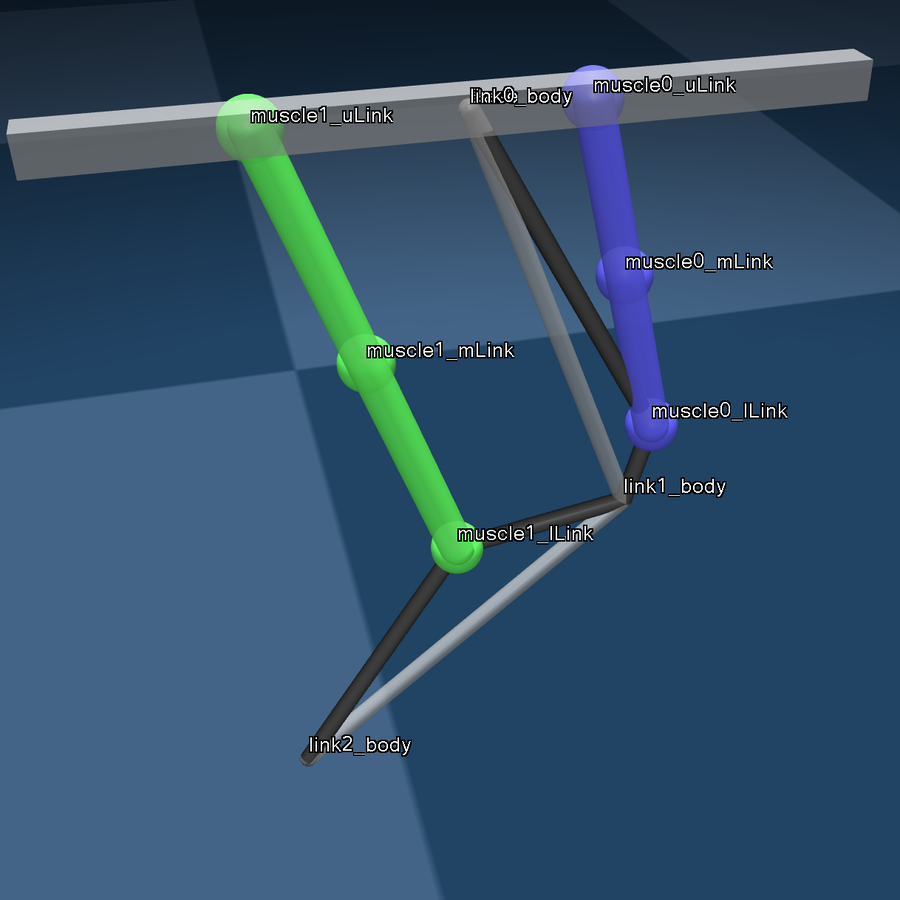
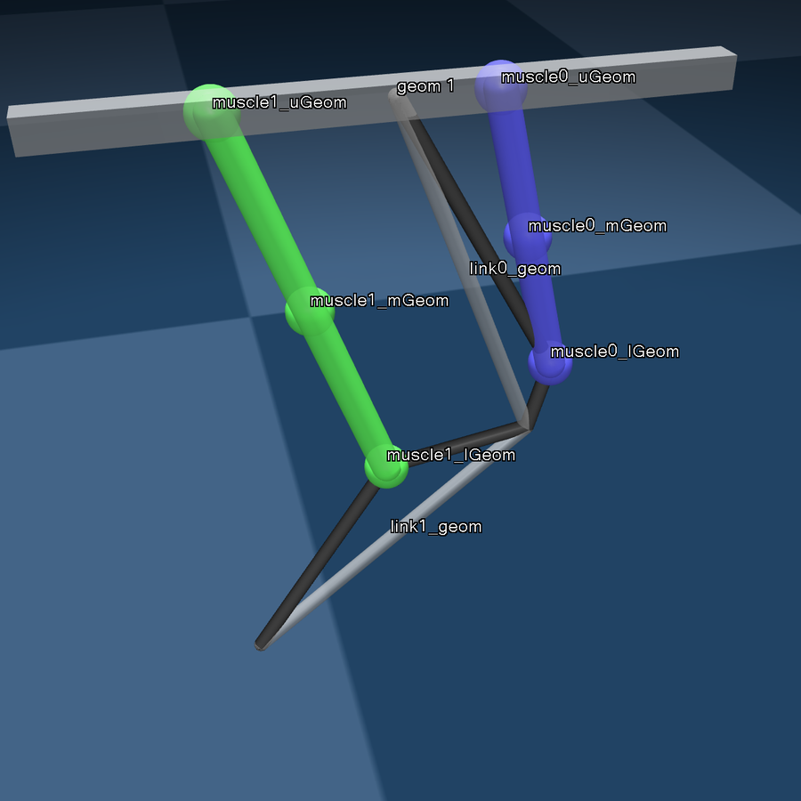
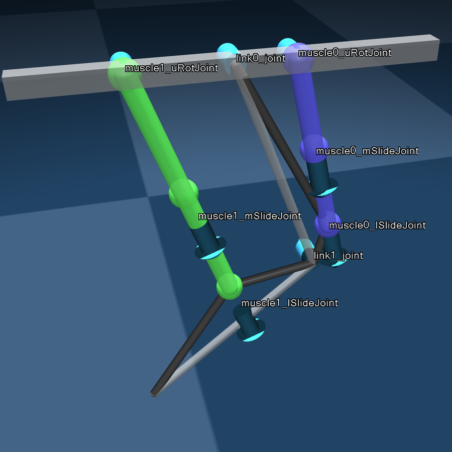

# EquiMus: Musculoskeletal Equivalent Dynamic Modeling and Simulation for Rigid-soft Hybrid Robots with Linear Elastic Actuators

## About This Work
Leveraging the full potential of soft robots relies heavily on dynamic modeling and control, which remains challenging due to their complex constitutive relationships and real-world operational scenarios. Bio-inspired musculoskeletal robots, which integrate rigid skeletons with soft actuators, combine the advantages of heavy load-bearing capacity and inherent flexibility. Although actuation dynamics has been studied through experimental methods and surrogate models, accurate and effective modeling and simulation still pose a significant challenge when soft actuators are applied at a large scale, especially in hybrid rigid-soft robots with continuously distributed mass, kinematic loops and diverse motion modes.

To address this issue, this study introduces EquiMus, a musculoskeletal equivalent dynamic modeling and MuJoCo-based simulation for rigid-soft hybrid robots with linear elastic actuators. The equivalence and effectiveness are proven in detail and examined through simulated and real experiments on a bionic robotic leg. Based on the energy-equivalent model and simulation, we do some explorations in model-based and data-driven control algorithms including reinforcement learning.

## Installation
- Clone the repo
~~~bash
git clone https://anonymous.4open.science/r/EquiMus-3DC5
cd EquiMus
~~~

- Run in Conda
~~~bash
conda create -n equimus python=3.11 -y
conda activate equimus
pip install -r requirements.txt
~~~

- Quick check
~~~bash
python -c "import mujoco; print('MuJoCo:', mujoco.__version__)"
~~~

## Run Demo

To run the demo, use the following commands in your terminal:

```bash
# Display help message
$ python demo/demo.py -h

# Run the simulation for the 2DOF or 3DOF model on Mac/Windows/Linux
$ mjpython demo/demo.py  # For macOS
$ python demo/demo.py    # For Windows
```

Upon successful execution, a simulation window will appear, showcasing the interactive viewer of the [MuJoCo passive-viewer](https://mujoco.readthedocs.io/en/stable/python.html#passive-viewer).

|  |  |
|:--:|:--:|
| **(a) Morphology with 3DOF** | **(b) Morphology with 2DOF** |

In the interactive viewer, you can observe the simulations of the 2DOF and 3DOF models. You can interact with the models using your mouse and keyboard, following [MuJoCo's GUI interaction conventions](https://www.youtube.com/watch?v=P83tKA1iz2Y).

|  |  |  |
|:--:|:--:|:--:|
| **(a) Body Labels** | **(b) Geom Labels** | **(c) Joint Labels** |
## Project Structure

The project is organized to align with the flow of the manuscript, ensuring clarity and ease of navigation. Please click to visit ReadMe file for each part.

- **models**: Contains MuJoCo `XML` files for simulation.
- **src**:
  - **validation_simulation**: Includes simulation-based validation.
    - [static](src/validation_simulation/static/ReadMe.md): Static validation details.
    - [dynamic](src/validation_simulation/dynamic/ReadMe.md): Dynamic validation details.
    - [morphology](src/validation_simulation/morphology/ReadMe.md): Morphological validation details.
  - **[validation_physical](src/validation_physical/ReadMe.md)**: Contains physical validation experiments.
    - static: Physical static validation.
    - dynamic: Physical dynamic validation.
  - **application**: Demonstrates the potential applications of the EquiMus method.
    - [PID_AutoTuning](src/application/PID_AutoTuning/ReadMe.md): PID auto-tuning application.
    - [RL_BallKicking](src/application/RL_BallKicking/ReadMe.md): Reinforcement learning for ball-kicking application.
- **utils**:
  - experiment.py: Utility script for experiments.
  - experiment_topology.py: Utility script for experiment topology.
- **ReadMe.md**: Project documentation.

## Requirements