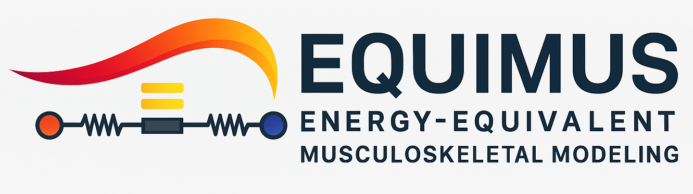
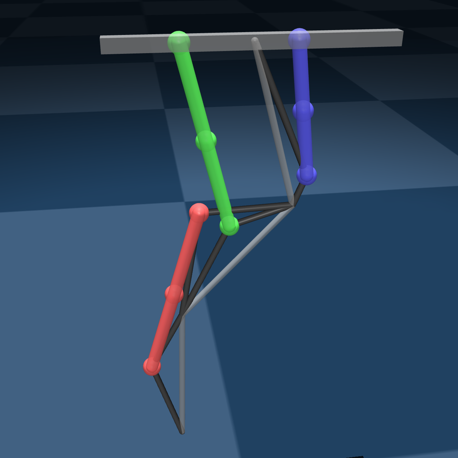
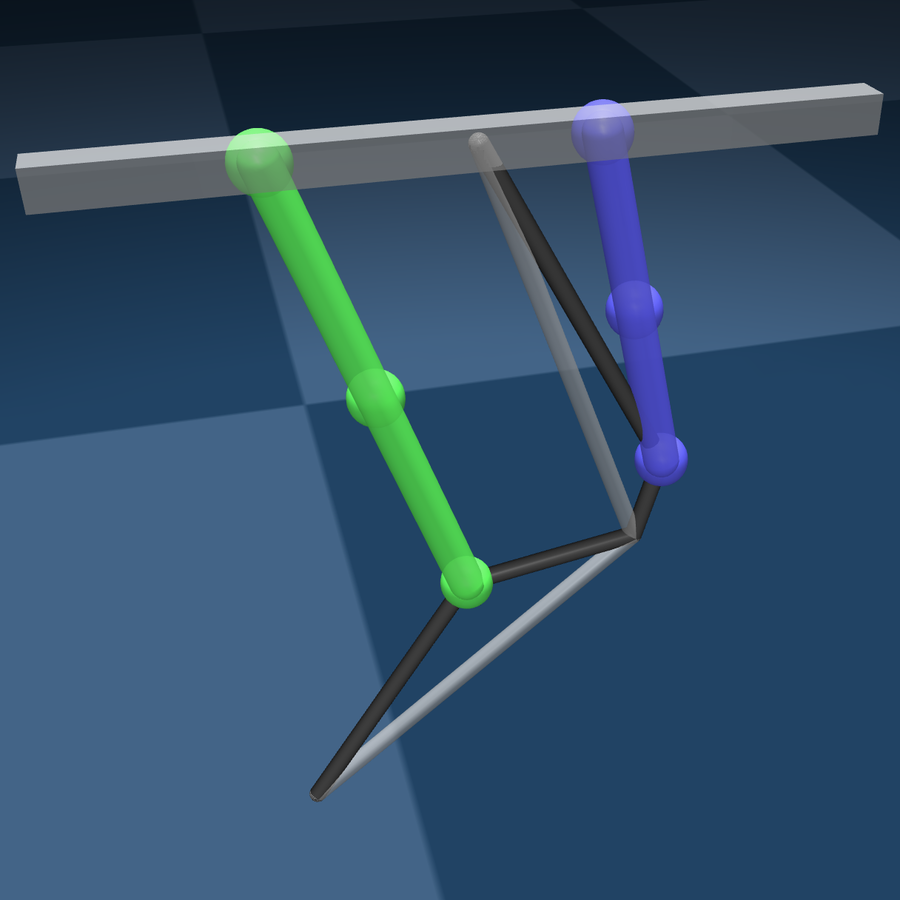

<p align="center">
  
</p>

# EquiMus: Musculoskeletal Equivalent Dynamic Modeling and Simulation for Rigid-soft Hybrid Robots with Linear Elastic Actuators

<p align="center">
  
  
  
  
</p>

<p align="center">

  <a href="https://arxiv.org/abs/2511.07887">
    
  </a>

  <!-- Previous Work -->
  <a href="https://ieeexplore.ieee.org/document/10989779">
    
  </a>

  <a href="https://ieeexplore.ieee.org/abstract/document/11204509">
    
  </a>

  <a href="https://fly-pigth.github.io/EquiMus.github.io/">
    
  </a>

  <!-- <a href="https://github.com/fly-pigTH/EquiMus/releases">
    
  </a> -->

  <a href="https://github.com/fly-pigTH/EquiMus/stargazers">
    
  </a>

</p>

<details>
  <summary><strong>Table of Contents</strong></summary>

- [EquiMus: Musculoskeletal Equivalent Dynamic Modeling and Simulation for Rigid-soft Hybrid Robots with Linear Elastic Actuators](#equimus-musculoskeletal-equivalent-dynamic-modeling-and-simulation-for-rigid-soft-hybrid-robots-with-linear-elastic-actuators)
  - [✏️ What is EquiMus?](#️-what-is-equimus)
  - [💡 What Problems Does EquiMus Solve?](#-what-problems-does-equimus-solve)
    - [1. Soft actuators are difficult to model—especially with dynamic mass redistribution](#1-soft-actuators-are-difficult-to-modelespecially-with-dynamic-mass-redistribution)
    - [2. Musculoskeletal systems contain kinematic loops](#2-musculoskeletal-systems-contain-kinematic-loops)
    - [3. High-fidelity soft-body simulation is too slow for control \& RL](#3-high-fidelity-soft-body-simulation-is-too-slow-for-control--rl)
    - [4. No unified workflow from CAD → simulation → real robot](#4-no-unified-workflow-from-cad--simulation--real-robot)
  - [🎶 Design Philosophy](#-design-philosophy)
  - [🚀 Install \& Run EquiMus (3 minutes)](#-install--run-equimus-3-minutes)
    - [Optional: Download Validation Data](#optional-download-validation-data)
    - [Optional: Install FFmpeg (for video logging)](#optional-install-ffmpeg-for-video-logging)
  - [📂 Project Structure](#-project-structure)
  - [🧭 Roadmap](#-roadmap)
  - [✉️ Contact](#️-contact)
  - [📖 Citation](#-citation)
</details>

## ✏️ What is EquiMus?

**EquiMus is an energy-equivalent dynamic modeling framework that brings musculoskeletal robots into real-time simulation, based on MuJoCo.** It converts soft actuators (e.g., pneumatic muscles, FEAs) into a rigorously derived **3-2-1 lumped-mass representation**, preserving their true kinetic, potential, damping, and actuation energies.

This allows EquiMus to accurately model **dynamic mass redistribution, biarticular routing, and kinematic loops** within standard MuJoCo workflows—features that are traditionally hard (or impossible) to simulate.

EquiMus provides:

- A physically consistent actuator model validated in **theory, simulation, and hardware**
- A MuJoCo-compatible implementation supporting **complex multi-muscle topologies**
- **Static, dynamic, and morphological** validation results
- Downstream examples including **PID auto-tuning**, **model-based control**, and **RL tasks**

👉 **In short: EquiMus makes muscle-driven robots truly simulatable.**

‼️ Note: Our repository **EquiMus** focuses on the verification of the energy-equivalent modeling method in MuJoCo simulation at this stage. For real-world application, we are still working on building a complete open-source toolbox **EquiMus-Toolbox** for musculoskeletal robot design, fabrication, and sim-to-real deployment. Stay tuned for updates!

## 💡 What Problems Does EquiMus Solve?

EquiMus addresses four long-standing pain points in musculoskeletal robot simulation:

### 1. Soft actuators are difficult to model—especially with dynamic mass redistribution  
Most simulators approximate muscles as massless springs, leading to incorrect dynamics.  
**→ EquiMus preserves actuator inertia, elasticity, damping, and work through an energy-equivalent formulation.**

### 2. Musculoskeletal systems contain kinematic loops  
URDF/PyBullet cannot represent multi-joint muscles or loop closures.  
**→ EquiMus uses MJCF with automatically generated constraints to model loops safely and robustly.**

### 3. High-fidelity soft-body simulation is too slow for control & RL  
FEM and Cosserat rod models are accurate but far from real time.  
**→ EquiMus achieves MuJoCo-level performance (>140× real-time) while retaining physical consistency.**

### 4. No unified workflow from CAD → simulation → real robot  
Current workflows require hand-built hacks and produce inconsistent dynamics.  
**→ EquiMus provides a clean, reproducible end-to-end pipeline, including calibration and sim-to-real examples.**

## 🎶 Design Philosophy
**[EN]** EquiMus fakes how nature uses energy to control motion — through an energy-equivalent formulation that turns physics intuition into simulation reality. That is the “fake it until you make it” philosophy in the energy domain.

**[CN]** 假之以能量，得之于运动。以伪成真，以虚造实。自然之道，人之所驭。

## 🚀 Install & Run EquiMus (3 minutes)

1. Clone the repo & install dependencies
~~~bash
git clone https://github.com/fly-pigTH/EquiMus.git
cd EquiMus
conda create -n equimus python=3.11 -y
conda activate equimus
pip install -r requirements.txt
~~~
2. Quick check
~~~bash
python -c "import mujoco; print('MuJoCo:', mujoco.__version__)"
~~~
3. Run the demo (2-DOF & 3-DOF musculoskeletal morphologies)
```bash
# Display help message
python demo/demo.py -h

# macOS (mjpython)
mjpython demo/demo.py --dof 3

# Windows/Linux
python demo/demo.py --dof 3
```

To run the 2-DOF morphology, use `--dof 2` instead of `--dof 3`.

If successful, a [MuJoCo passive-viewer](https://mujoco.readthedocs.io/en/stable/python.html#passive-viewer) will open:

|  |  |
|:--:|:--:|
| **(a) 3-DOF Morphology** | **(b) 2-DOF Morphology** |

You can rotate, drag, and actuate the model using standard MuJoCo GUI controls following ([MuJoCo interaction conventions](https://www.youtube.com/watch?v=P83tKA1iz2Y)).


### Optional: Download Validation Data
Dynamic-validation examples require extra datasets:

👉 Download here: https://drive.google.com/file/d/1wKS-2Aa7IVpy4-AHKAF68sH8nZ6IhQTV/view?usp=drive_link

Place the extracted `data/` folder inside `src/validation_simulation/dynamic/`. Static & morphology validation demos already include necessary data.

### Optional: Install FFmpeg (for video logging)
- MacOS
~~~
brew install ffmpeg
~~~
- Windows
~~~
conda install -c conda-forge ffmpeg
~~~
- Linux
~~~
sudo apt update
sudo apt install ffmpeg
~~~


## 📂 Project Structure

The project is structured to mirror the workflow presented in the paper, making it easy to navigate and reproduce all experiments. Each module includes its own `ReadMe` for quick reference. 

```txt
EquiMus/
├── models/                         # MuJoCo XML models
│   ├── 2DOF/
│   ├── 3DOF/
│   └── ...
│
├── src/
│   ├── validation_simulation/      # Simulation-based validation
│   │   ├── static/                 # ├─ Static validation
│   │   │   └── ReadMe.md
│   │   ├── dynamic/                # ├─ Dynamic validation
│   │   │   └── ReadMe.md
│   │   └── morphology/             # └─ Morphology generalization
│   │       └── ReadMe.md
│   │
│   ├── validation_physical/        # Real-world experiments
│   │   ├── static/
│   │   ├── dynamic/
│   │   └── ReadMe.md
│   │
│   ├── application/                # Downstream usage demos
│   │   ├── PID_AutoTuning/         # ├─ PID auto-tuning demo
│   │   │   └── ReadMe.md
│   │   └── RL_BallKicking/         # └─ RL ball-kicking demo
│   │       └── ReadMe.md
│   │
│   └── utils/
│       ├── experiment.py           # Utility script for experiments.
│       └── experiment_topology.py
│
├── demo/                           # Demo scripts & figures
│
├── media/                          # Logos & website resources
│
├── requirements.txt
├── LICENSE
└── ReadMe.md                       # Main documentation
```

## 🧭 Roadmap
We are actively developing **EquiMus** and have outlined the following roadmap for future enhancements and features:
- [ ] **EquiMus Toolbox (will be released before December 2025)**
  - [ ] Automated actuator parsing from URDF/MJCF
  - [ ] Automatic 3-2-1 reconstruction & constraint generation
  - [ ] Support for batch model conversion
- [ ] **Model Library Expansion**
  - [ ] Single-joint actuator examples (FEA, McKibben)
  - [ ] Biarticular / multi-joint muscles
  - [ ] Rigid–soft hybrid benchmark models
- [ ] **Parameter Identification Suite**
- [ ] **Documentation & Website**
  - [ ] Tutorials & interactive examples
  - [ ] Model Zoo on website


## ✉️ Contact
If you are interested in collaborating, have questions, or need support, please feel free to reach out to us!
- Yinglei Zhu: zylbhsf@gmail.com
- Huichan Zhao: zhaohuichan@mail.tsinghua.edu.cn

## 📖 Citation
If you find EquiMus helpful, please cite us:

```bibtex
@article{zhu2025equimus,
  title={EquiMus: Energy-Equivalent Dynamic Modeling and Simulation of Musculoskeletal Robots Driven by Linear Elastic Actuators},
  author={Zhu, Yinglei and Dong, Xuguang and Wang, Qiyao and Shao, Qi and Xie, Fugui and Liu, Xinjun and Zhao, Huichan},
  journal={IEEE Robotics and Automation Letters},
  year={2025},
  publisher={IEEE}
}
```
