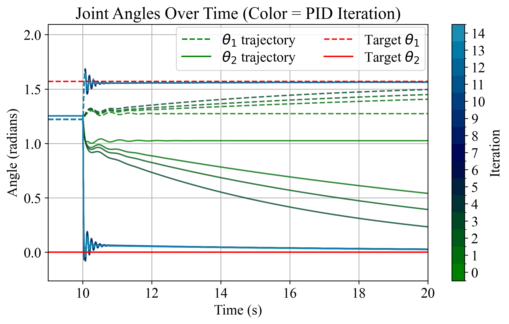

# Application 1: PID Auto-Tuning

This repository contains a PID auto-tuning experiment based on our equivalent model implemented in **MuJoCo**, using L-BFGS-B and Differential Evolution algorithms to optimize PID controllers. The pipeline outputs experiment data, plots, and videos for analysis and reproducibility.

## ⌘ Results

Our goal is to control the robotic leg to reach and maintain a static, upright configuration at $(\pi/2, 0)$ using a PID controller. The optimization objective is to minimize the mean square error (MSE) between the actual joint angles and the desired target.

To accomplish this, we adopt a two-stage optimization strategy: an initial L-BFGS-B phase provides local refinement of the PID parameters, followed by a Differential Evolution stage for broader, global exploration. Across iterations, the results clearly demonstrate that the tuned PID controller increasingly improves tracking accuracy, steadily reducing error and driving the robotic leg toward the desired upright state.


## 📦 Project Structure

- `PID_experiment.py`: Main experiment script (runs PID optimization).
- `data_analysis.py`: Analysis and plotting script.
- `data/`: Generated CSV/NPY data from experiments.
- `figure/`: Plot output directory.
- `video/`: Video output directory.

## 🚀 Requirements
Same as the whole work directory.

## ▶️ How to Run the Experiment

1. **Run PID Optimization**
```bash
python src/application/PID_AutoTuning/main.py
```
- Output: parameter CSV (`data/parameters.csv`), experiment NPY data, videos (`video/`)

2. **Run Data Analysis & Plotting**
```bash
python src/application/PID_AutoTuning/data_analysis.py 
```
- Output: iteration trajectory plots (`figure/joint_trajectory.png`)

## ⚙️ Key Features
- **PID Parameter Optimization**: Combines L-BFGS-B for local search and Differential Evolution for global exploration.
- **Simulation Control**: Uses a MuJoCo implementation of our method on the robotic leg for PID response simulation.
- **Result Analysis**: Automatically generates error metrics, plots, and videos for review.

## 📂 Output Files
- `parameters.csv`: Stores PID parameters and error values for each optimization iteration.
- `experiment_data.npy`: Stores time-series data ($\theta_1$, $\theta_2$, control inputs).
- `PID_{iter}_xxx.mp4`: Video for each optimization iteration.

## 🤝 Contribution & Development
- You can modify the parameter bounds or optimization methods in `PID_experiment.py` to experiment with different controllers.
- To add new plot types, extend plotting functions in `data_analysis.py`.

## 📜 License
MIT License
