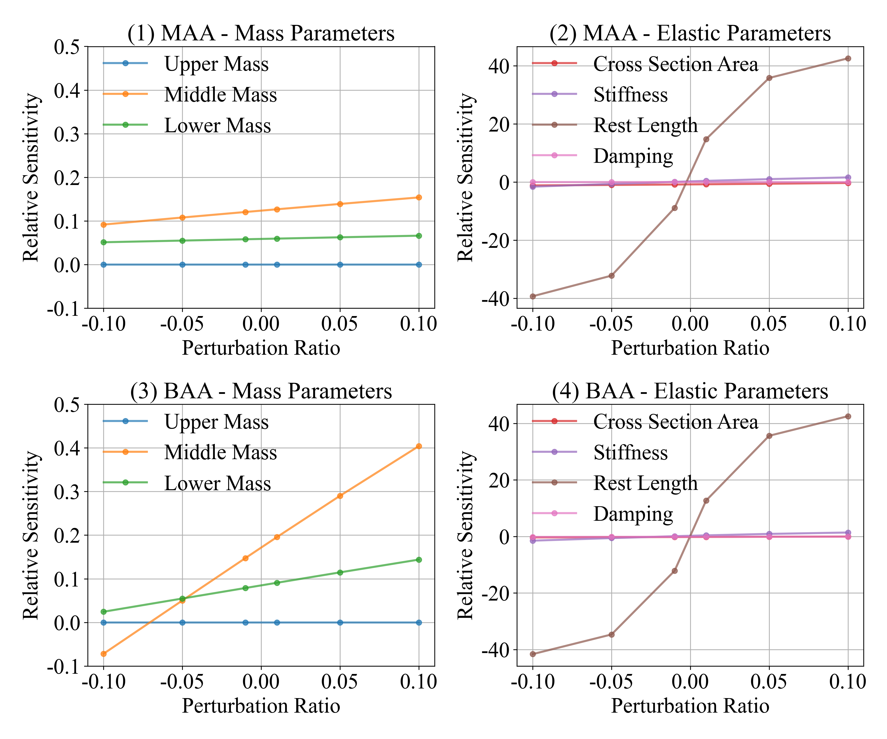
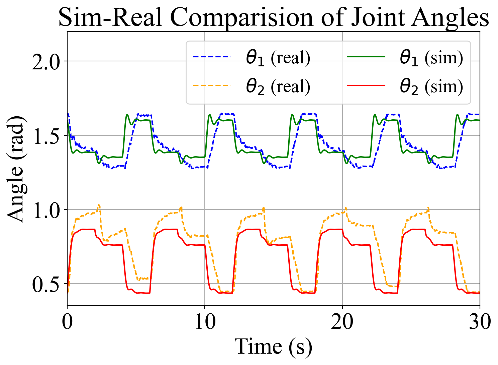

# Validation of Physical Models

## File Tree

```text
.
├── dynamic
│   ├── data
│   │   ├── ToCenter_2025-02-20_21-06-20_A2B_data.csv: [Physical trajectory.]
│   │   └── TriStatic_2025-01-21_19-26-44_A2B_data.csv: [Physical trajectory, tracking 3 steps pressure steps.]
│   ├── dynamic_sysid.ipynb
│   ├── figure
│   │   ├── sensitivity_analysis.pdf
│   │   ├── sensitivity_analysis.png
│   │   └── tri_trajectory.png
│   ├── log
│   │   ├── baseline_analysis.csv
│   │   ├── sensitivity_analysis.csv
│   │   └── triangle_error.csv
│   ├── scripts
│   ├── sensitivity_analysis_with_baseline.ipynb
│   ├── trajectory_track_triangle.ipynb
│   └── video
│       └── output_video.mp4
├── ReadMe.md
├── static
│   ├── data
│   │   └── real_static_state
│   ├── figure
│   ├── log
│   │   ├── regression_pressure_error_summary(effective).csv
│   │   ├── RMSE_error_summary(all).csv
│   │   ├── RMSE_error_summary(effective).csv
│   │   ├── simulated_static_state_error_all.csv
│   │   ├── simulated_static_state_error_effective.csv
│   │   └── sysid_parameters.csv
│   ├── scripts
│   │   └── sysid_static_effective.py
│   └── video
└── static_qpos_analysis.py
```
## Run

```bash
cd src/validation_physical/ 
```

1. Execute `./static_qpos_analysis.py` to analyze the static states of the robotic leg for both effective and complete datasets.
2. Use `./static/scripts/sysid_static_effective.py` to identify static parameters from the effective dataset. 
3. Open and run `./dynamic/dynamic_sysid.ipynb` to analysis the static error. (Note: the optimization of the real experiment is captured in `src/validation_physical/dynamic/log/optimization_log`. For some reason on the seed and experiment setting, the result is slightly different with `dynamic_sysid`)
4. Run `./dynamic/sensitivity_analysis_with_baseline.ipynb` to conduct sensitivity analysis and baseline experiments.
5. Analyze trajectory tracking by running `./dynamic/trajectory_track_triangle.ipynb`.

## Results
- **Sensitivity Analysis**  



- **Trajectory Tracking**  


