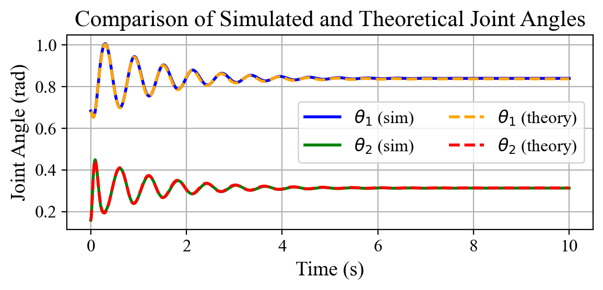
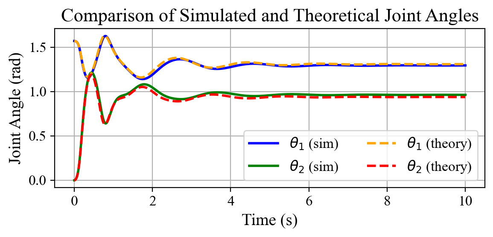
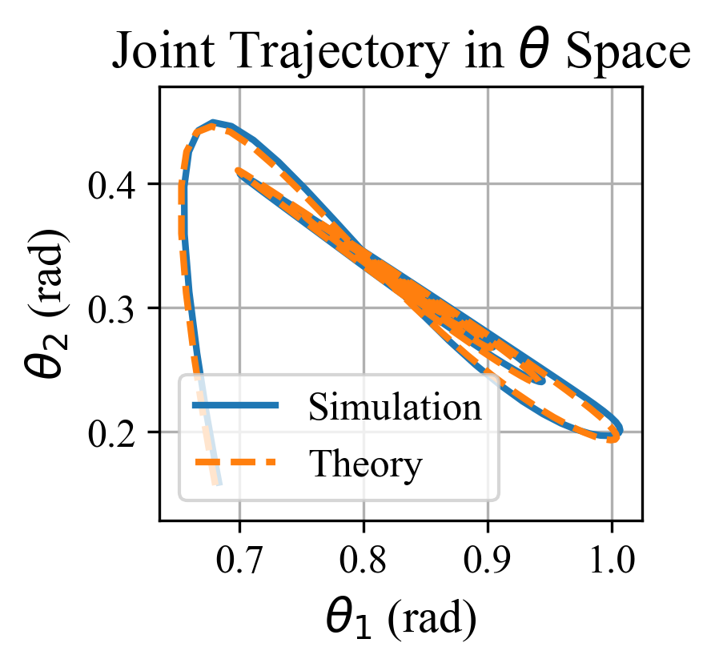
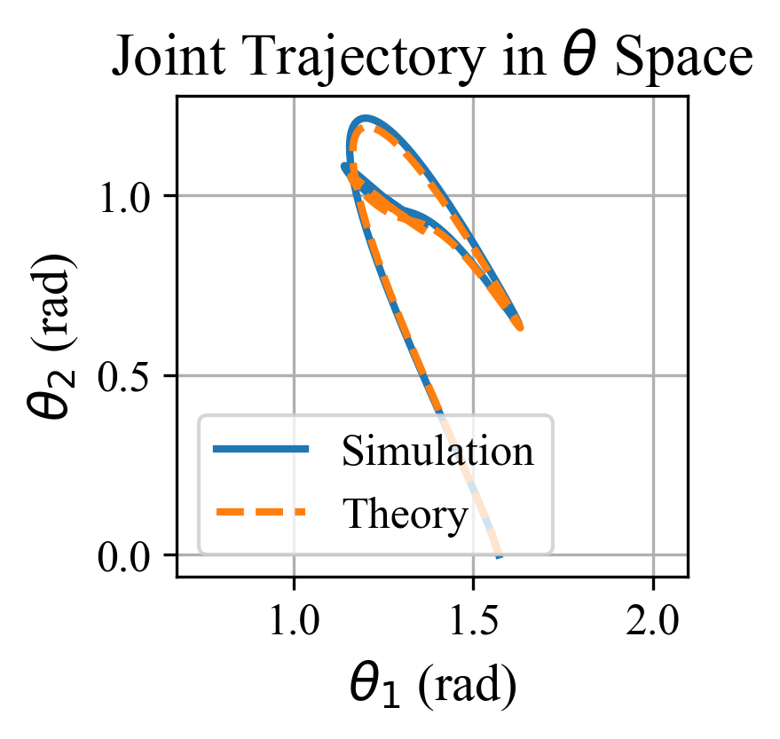

# Dynamic Validation in Simulation

## How to Run
1. Navigate to this directory:
    ```bash
    cd src/validation_simulation/dynamic
    ```
2. Execute the following scripts in order:
    ```bash
    python scripts/sim_stance.py
    python scripts/sim_swing.py
    python scripts/stance_analysis.py
    python scripts/swing_analysis.py
    ```

## Output Details

- **`video/`**: Contains recordings of the dynamic response during both stance and swing phases.
- **`log/`**: Provides detailed simulation logs, including RMSE values.
- **`data/matlab_theo/`**: Stores theoretical data from MATLAB for comparison purposes.

*Figure X. Dynamic simulation: swing/stance phases and their trajectories.*

|  |  |
|:--:|:--:|
| Swing joint trajectories-1 | Stance joint trajectories-1 |
|  |  |
| Swing joint trajectories-2 | Stance joint trajectories-2 |
